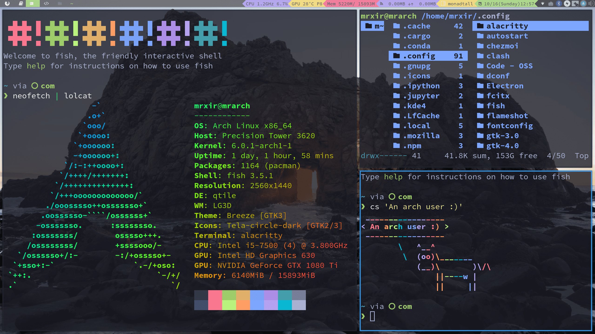

This post is about my own archlinux installation and configuration process from archiso on.

**Updating...**

## Installation Procedure

1. Download Newest [Archlinux GUI Distribution ISO](https://archlinuxgui.in/)
2. Prepare an U Disk for [Ventoy](https://www.ventoy.net/cn/index.html) installation
3. Place all your OS iso files and PE into the available ventoy partition
4. Reboot and press corresponding mainboard keys to enter boot option interface
5. Select U Disk boot option and select your OS option
6. Just install by the `Install Arch Linux` software

## Configuration Steps after Installation

1. Run `sudo pacman -Syyu` for update all packages to avoid some possible errors
2. Run `sudo vim /etc/pacman.conf` for insert [archlinuxcn](https://github.com/archlinuxcn/mirrorlist-repo) and uncomment multitest source
3. Open [Archlinux Mirrorlist](https://archlinux.org/mirrorlist/) for selelcting Chinese mirrorlist and place the fastest in the first place, then run `sudo pacman -Syyu && sudo pacman -S archlinux-keyring archlinuxcn-keyring && sudo pacman -Syyu` for updating all packages
4. Run `sudo pacman -S vim clash chezmoi` for facilitating successive steps
5. Open [V2Free](https://w1.v2free.net/) for getting clash configuration
6. Run `clash` and this will automatically generating essential dbs and config file for using, and `vim ~/.config/clash/clash.yaml`, paste copied configuration, and then modify the socks port to 1089, at last, run clash at any terminal
8. Run `paru` for paru updating packages
9. Run `git config --global http.proxy 127.0.0.1:7890 && git config --global https.proxy 127.0.0.1:7890`
10. Run `chezmoi init --apply https://github.com/XIRZC/dotfiles.git`, and open [Github personal access tokens](https://github.com/settings/tokens), login and generate a token as password
11. Run `sudo pacman -S qtile alacritty kitty fish zsh ranger feh neovim rofi picom starship yarn npm xclip psutil python3 ruby perl python-pip && pip install pynvim psutil && gem install neovim` for preliminary configuration
12. Open [DistroTube Gitlab: Shell Color Scripts](https://gitlab.com/dwt1/shell-color-scripts) and follow the README guide to install colorscript in the bin, specifically by `cd ~/Downloads && git clone https://gitlab.com/dwt1/shell-color-scripts.git && cd shell-color-scripts && sudo make install`
13. Run `paru -S nerd-fonts-complete && sudo pacman -S wqy-microhei wqy-zenhei adobe-source-han-sans-cn-fonts adobe-source-han-serif-cn-fonts` for nerdfont and chinese font support([chinese font archlinux wiki page](https://wiki.archlinux.org/title/Localization/Simplified_Chinese))
14. Run `sudo pacman -S htop exa bat kdiff3 neofetch lolcat figlet cowsay blueman pulseaudio pavucontrol pamixer brightnessctl udiskie ntfs-3g volumeicon cbatticon libnotify notification-daemon networkmanager network-manager-applet fcitx fcitx-configtool fcitx-googlepinyin tmux screen axel lazygit flameshot screenkey zotero sioyek code zathura mpv vlc gimp filezilla && paru -S toilet` for all kinds of useful packages
15. Run `cd ~/Downloads/ && git clone https://github.com/vinceliuice/grub2-themes && cd grub2-themes && sudo ./install.sh -t whitesur -s 2k -b && grub-install --target=x86_64-efi --efi-directory=/boot/efi` for grub theme beatify([grub2-themes link](https://github.com/vinceliuice/grub2-themes))
16. Run `cd ~ && rm -rf Pictures && git clone https:/github.com/XIRZC/mywp.git Pictures` for feh directory setting
17. Run `git clone https://github.com/cdump/ranger-devicons2 ~/.config/ranger/plugins/devicons2` for ranger icon
18. Run `curl https://raw.githubusercontent.com/oh-my-fish/oh-my-fish/master/bin/install | fish` for oh-my-fish installation
19. Run `starship preset pastel-powerline > ~/.config/starship.toml` or `starship preset nerd-font-symbols > ~/.config/starship.toml` for starship command line prompt configuration([starship link](https://starship.rs/presets/))
20. Run `cd ~/Downloads && axel -n 10 https://developer.download.nvidia.com/compute/cuda/10.2/Prod/local_installers/cuda_10.2.89_440.33.01_linux.run && chmod +x cuda_10.2.89_440.33.01_linux.run && paru -S gcc8 && sudo pacman -S nvidia nvidia-settings nvidia-utils nvtop && sudo ./cuda_10.2.89_440.33.01_linux.run` for cuda 10.2 installation([cuda 10.2 download link](https://developer.nvidia.com/cuda-10.2-download-archive?target_os=Linux&target_arch=x86_64&target_distro=Ubuntu&target_version=1804&target_type=runfilelocal), [gcc compatible version with cuda version](https://stackoverflow.com/questions/6622454/cuda-incompatible-with-my-gcc-version))
21. Run `cd ~/Downloads && axel -n 10 https://repo.anaconda.com/miniconda/Miniconda3-py37_4.12.0-Linux-x86_64.sh && chmod +x Miniconda3-py37_4.12.0-Linux-x86_64.sh && ./Miniconda3-py37_4.12.0-Linux-x86_64.sh` for miniconda installation([minconda download link](https://conda.io/projects/conda/en/latest/user-guide/install/linux.html))
21. Follow the instruction in [Tsinghua Conda](https://mirrors.tuna.tsinghua.edu.cn/help/anaconda/) and [Tsinghua Pip](https://mirrors.tuna.tsinghua.edu.cn/help/pypi/) for conda and pip acceleration
22. Run `conda create -n com python=3.7 && conda activate com && conda install pytorch==1.8.0 torchvision==0.9.0 torchaudio==0.8.0 cudatoolkit=10.2 -c pytorch` for configure a common `python=3.7, pytorch=1.8, torchvision=0.9, torchaudio=0.8, cudatoolkit=10.2` python virtual environment([pytorch previous version link](https://pytorch.org/get-started/previous-versions/#v180))
23. Run `timedatectl set-local-rtc 1 --adjust-system-clock` for fix windows&linux timezone conflict(localtime for windows, utc for linux)
24. Config Zotero by validate by webdav `dav.jianguoyun.com/dav`, and then opening [Jianguoyun setting link](https://www.jianguoyun.com/d/home#/safety) for query password

> Reference: https://github.com/antoniosarosi/dotfiles

## Original Archlinux Live ISO useful commands

Here are some pre-utils to use:

- `ip link` for look up wlan interface configuration and status
- `wpa_passphrase $SSID $PWD > X.conf` for generate corresponding network connection configuration
- `wpa_supplicant -c X.conf -i wlan0 -B` for connect corresponding wifi in the background
- `dhcpcd &` for configure wifi ip address if the network doesn't work
- `fdisk -l` for list disk partition
- `mkfs.ext4` for make format for linux partition
- `mkswap` for make format for swap
- `mkfs.fat` for make format for EFI partition
 
Here are six important successive commands: 
 
- `pacstrap /mnt base linux linux-firmware` for install linux into mounted linux main partition
- `genfstab -U /mnt >> /mnt/etc/fstab` for system config
- `arch-chroot /mnt` for change root into new system
- `pacman -S grub efibootmgr intel-ucode os-prober` for important system essentials
- `grub-mkconfig > /boot/grub/grub.cfg` for grub configuration generation
- `grub-install --target=x86_64-efi --efi-directory=/boot` for grub installtion
 
Here are some other useful commands for daily use:
- `sudo pacman -R $(pacman -Qtdq)` for delete some not useful dependency packages
- [This link has some useful commands for clean pacman cache](https://zhongguo.eskere.club/%E5%A6%82%E4%BD%95%E6%B8%85%E7%90%86-arch-linux-%E4%B8%AD%E7%9A%84%E5%8C%85%E7%BC%93%E5%AD%98/2021-09-03/)
 